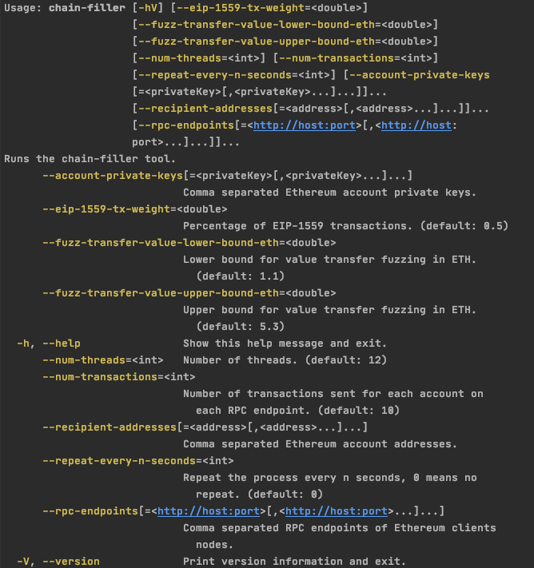

## EIP-1559 tx sender

### Install
```shell script
./gradlew installDist
```
### Usage

#### Help
```shell script
./build/install/eip1559-tx-sender/bin/eip1559-tx-sender --help
```

#### Sample

```shell script
./build/install/eip1559-tx-sender/bin/eip1559-tx-sender \
--rpc-endpoints=http://besu:8545,http://geth:8545 \
--account-private-keys=0xae6ae8e5ccbfb04590405997ee2d52d2b330726137b875053c36d94e974d162f \
--num-transactions=100 \
--eip-1559-tx-weight=0.32 \
--num-threads=8
```

